# Vue.js + Django REST Framework

<h2>Essa aqui é pros desenvolvedores Django que querem dar um 
passo a mais nos projetos:</h2>

Já pensou em sair das amarras dos templates do Django e desacoplar 
o frontend do backend? Eu consegui fazer isso com Docker, 
Django REST Framework, Vue.js e Nginx.

Antes de começar, vale a pena ver alguns conceitos. Se não 
precisar, basta pular pra prática 😁 <hr>

## Utilizando este projeto
Bom, se você quiser instalar esse projeto e utilizar de alguma
forma, aqui vai o passo a passo:

__Senão, pule direto para o tutorial!__

### Clonando o repositório:
Para clonar esse repositório, digite o comando:

__SSH:__ ```git clone git@github.com:weblerson/Vue-DRF.git```

__HTTPS:__ ```git clone https://github.com/weblerson/Vue-DRF.git```

### Lidando com as variáveis de ambiente
Agora é necessário lidar com as variáveis de ambiente.

Esse repositório vem com um arquivo example.env. Ele guarda as
nossas variáveis de exemplo.

Para utilizar, altere o nome do arquivo para ```.env``` manualmente
ou com o comando, na raiz do projeto: ```mv example.env .env```

### Coletando arquivos estáticos
Para fazer a coleta dos arquivos estáticos, é necessário instalar
o Django.
Para isso, siga os seguintes passos:

Na raiz do projeto, crie um ambiente virtual:

__Windows:__ ```python -m venv .venv```

__Linux:__ ```python3 -m venv .venv```

Agora, é só ativar seu ambiente virtual:

__Windows:__ ```.venv/Scripts/Activate```

__Linux:__ ```source .venv/scripts/activate```

Após isso, certifique-se de entrar dentro da pasta ```backend```:

__Comando:__ ```cd backend```

E, feito isso, colete os arquivos estáticos com o comando:

__Windows:__ ```python manage.py collectstatic```

__Linux:__ ```python3 manage.py collectstatic```

Agora é só subir os containers usando o docker compose!

O comando é o seguinte: ```docker compose up --build```
ou ```docker-compose up -d -V```

Agora é só navegar nas rotas ```localhost/``` e 
```localhost/api/``` para ver o projeto funcionando! <hr>

# Início do Tutorial:
## Django:
Segundo a própria documentação, Django é um framework web Python de alto nível construído em um design limpo e pragmático em que o desenvolvedor precisa focar no produto, pois o framework já cuidou de boa parte das dores de cabeça do desenvolvimento web. Além disso, é de código aberto!

[Clique aqui](https://docs.djangoproject.com/en/4.1/)
para acessar a documentação oficial do Django <hr>

## Django REST Framework:
Na sua documentação diz que o DRF é um kit de ferramentas poderoso 
e flexível para construir APIs na web. Basicamente, é um app 
Django poderosíssimo para construir REST APIs de maneira fácil, 
organizada e robusta. Vale lembrar que ele depende do Django por 
ser uma extensão dele, enquanto o contrário não é verdadeiro.

[Clique aqui](https://www.django-rest-framework.org/)
para acessar a documentação oficial do Django REST Framework <hr>


## Vue.js:
Esse aqui não vou saber definir com muitos detalhes. Mas, 
basicamente, é um framework JavaScript para construir apps frontend 
baseados em componentes.

Mais informações no site oficial: [Vue.js](https://vuejs.org/) <hr>

## Docker:
Docker já é um negócio diferente. É como um serviço de containers 
para separar aplicações em ambientes isolados sobre um mesmo 
sistema operacional, garantindo segurança e tirando aquele 
problema do “na minha máquina funciona”, já que roda sobre um 
SO Linux.

Para mais informações sobre o Docker,
[clique aqui](https://www.docker.com/) <hr>

## Nginx:
Essa aqui foi minha mais recente descoberta. Nginx é um software que possui diversas utilizações, como webserver, proxy reverso, caching, load balancer entre outros. Muito performático e trabalha com single-thread, usa baixa memória e suporta alta concorrência. É potente.

Site oficial: [Nginx](https://www.nginx.com/) <hr>

Agora sim, vamos pra prática! 🎉

Primeiro, é necessário que você tenha o docker engine, 
docker compose e Python instalados em sua máquina. A partir daqui, 
é só ladeira acima!

*__Nota: vou usar o gerenciador de pacotes pip. Mas podem usar 
pipenv e afins. Se tiverem problemas para usar o pipenv podem me 
chamar.__* <hr>

## Criação do Ambiente Virtual
Primeiro, vamos criar um ambiente virtual dentro da raiz do 
projeto:

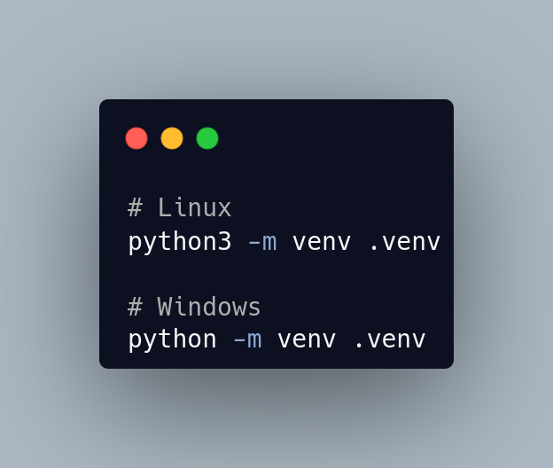 <hr>

## Entrar no Ambiente Virtual
Após isso, precisamos entrar no ambiente virtual com o comando:

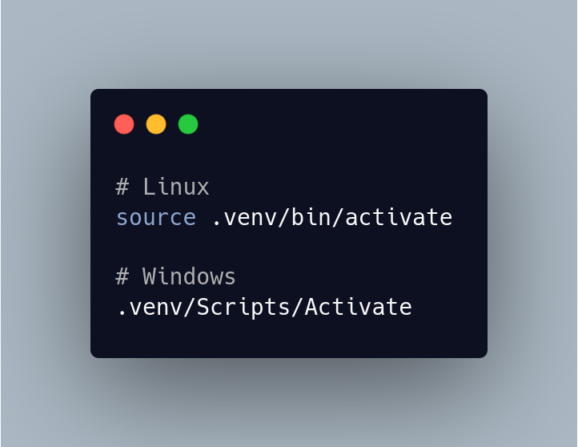 <hr>

## Instalação das Bibliotecas
Agora, só instalar o Django e o Django REST Framework com o 
python-decouple para lidar com variáveis de ambiente e o 
servidor wsgi gunicorn:

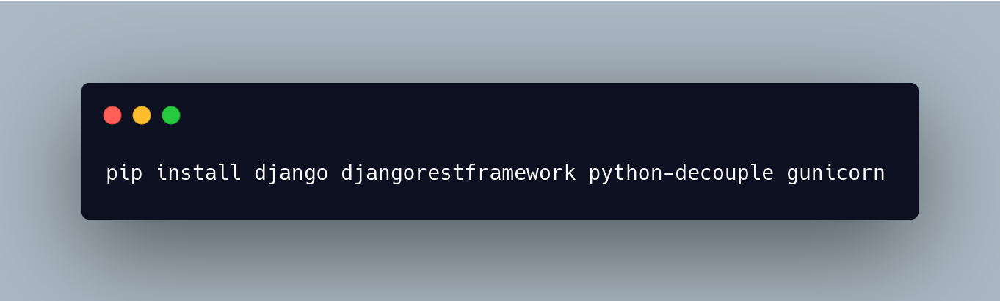 <hr>

## Criação do Projeto Django
Feita a instalação, vamos criar o projeto Django na raiz do 
projeto:

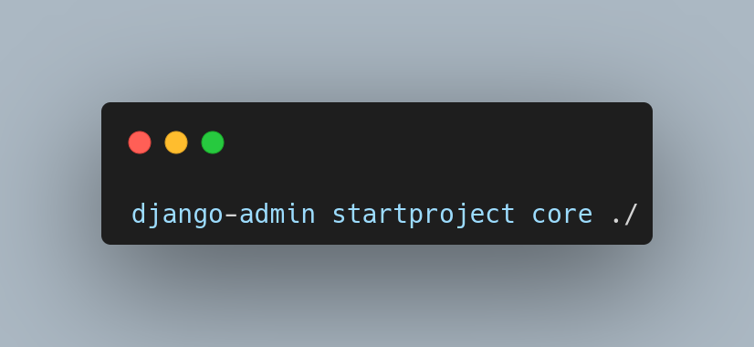 <hr>

## Instalando o App *rest_framework*
Agora, com o projeto criado e as variáveis de ambiente 
configuradas (não vou tratar disso aqui), vamos colocar o 
Django REST Framework na lista de apps instalados adicionando o 
app ‘rest_framework’ aos INSTALLED_APPS:

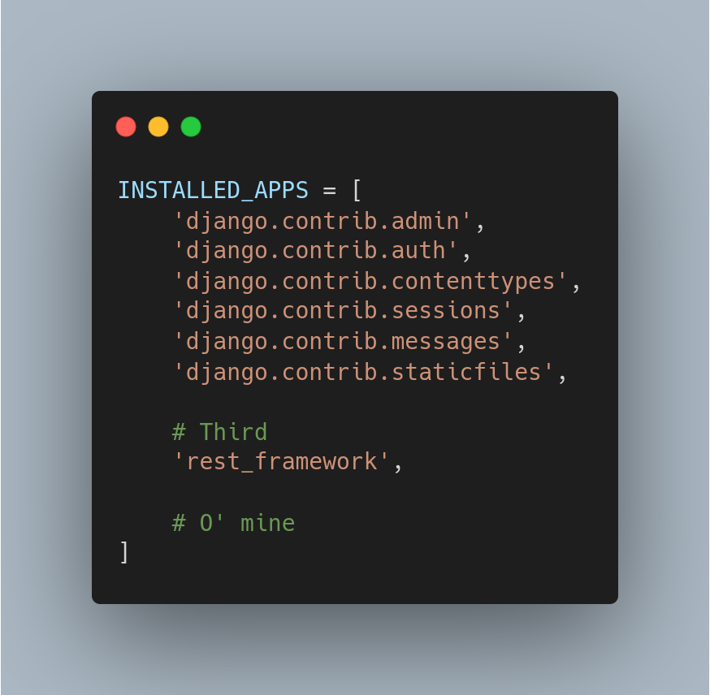 <hr>

## Separando as Stacks por Módulos
Agora, vamos de Docker!

Primeiro, vamos fazer o seguinte: separar backend de frontend 
em pastas distintas na raiz do projeto

root<br>
\_ backend<br>
\_ frontend

Para isso, basta criar uma pasta ```backend``` e mover todo o 
projeto django para dentro, com exceção das variáveis de 
ambiente, .gitignores e seu ambiente virtual

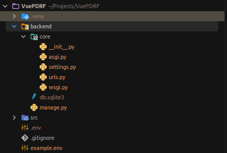 <hr>

## Criando o Dockerfile para o Backend
Agora sim, podemos escrever nosso Dockerfile pro backend!

Vou usar esse padrão de Dockerfile para Python 
(lembre-se de colocá-lo dentro da pasta backend):

 <hr>

## Criaçao do docker-compose.yaml
Agora, na raiz do projeto, vamos criar nosso arquivo 
docker-compose.yaml, para rodar múltiplos contêineres, com a 
seguinte configuração inicial:

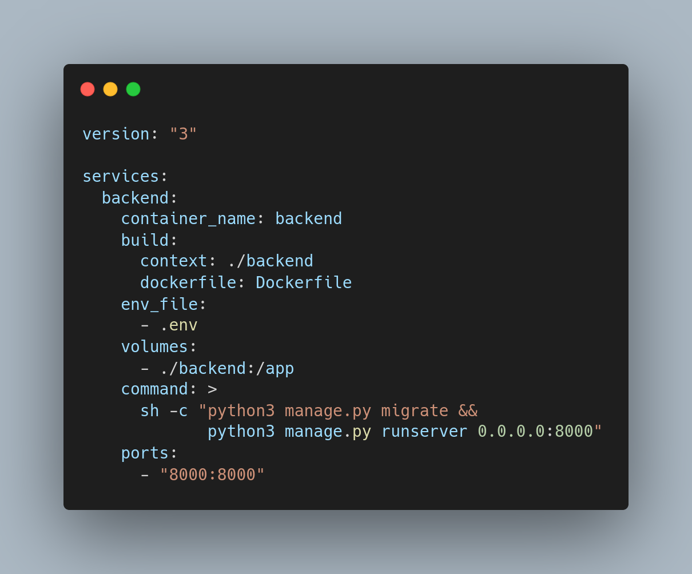 <hr>

Com ela, já é possível executar o comando 
```docker compose up –build``` e acessar o welcome do django no 
localhost:8000

## Criação do Projeto Vue.js
Agora sim podemos criar o projeto vue.js na pasta frontend!
Para isso, basta digitar, na raiz do projeto, o comando (instalação na documentação): 

Siga o passo a passo do CLI. Vou escolher o nome do projeto como 
```frontend```.


Agora a estrutura do nosso projeto está assim:

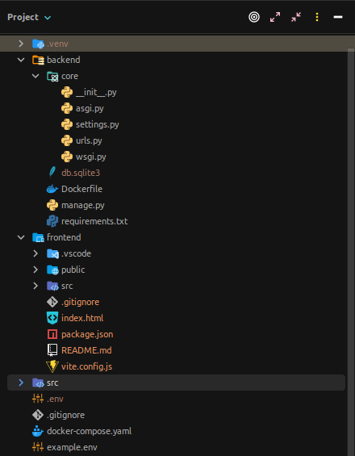 <hr>

## Configuração do módulo do Frontend
Agora, precisamos fazer 3 coisas:

Na pasta frontend, criar uma pasta para o arquivo de configuração do Nginx.
Além disso, dentro da mesma pasta, criar o Dockerfile para o frontend

frontend <br>
 \_nginx <br>
 \   \_ nginx.conf <br>
 \_ Dockerfile

Vamos usar as seguintes configurações para cada:

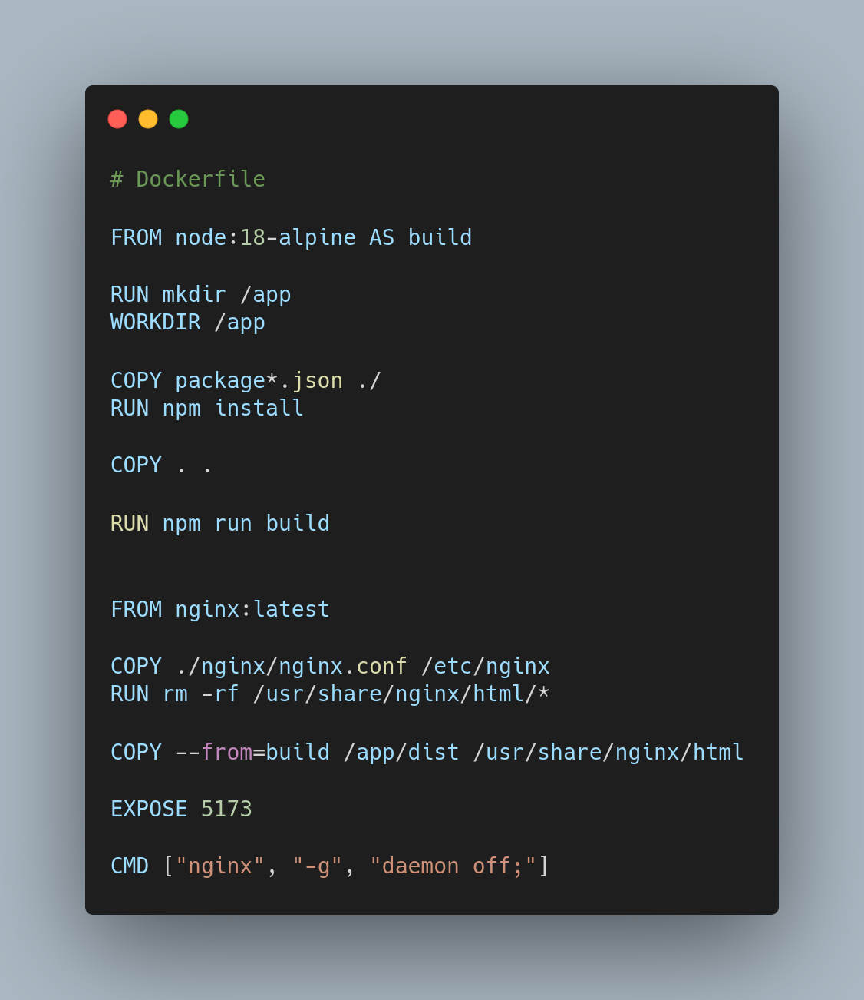
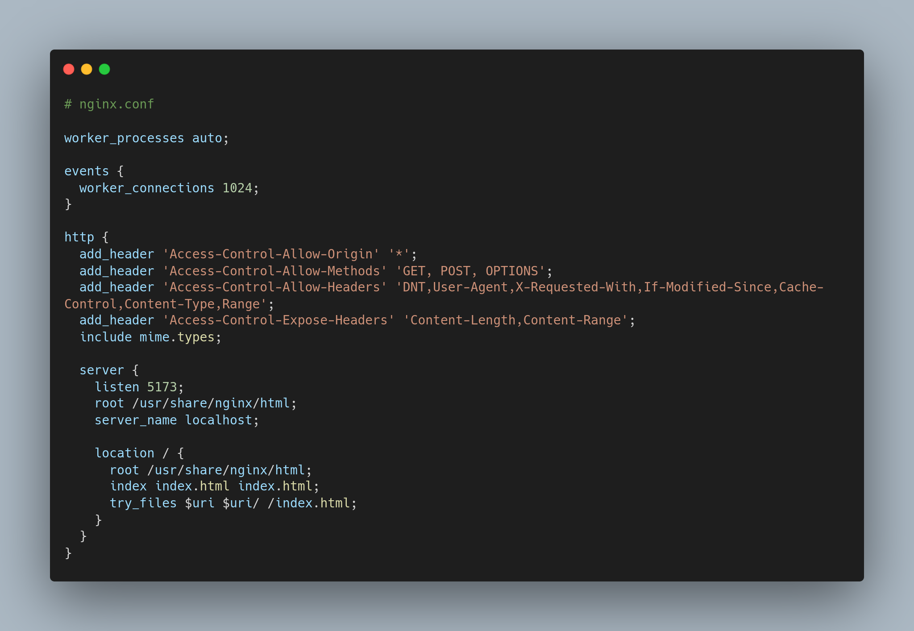 <hr>

## Criar o service frontend
Agora, pra finalizar a configuração do frontend, só falta 
adicioná-lo ao docker-compose.yaml:

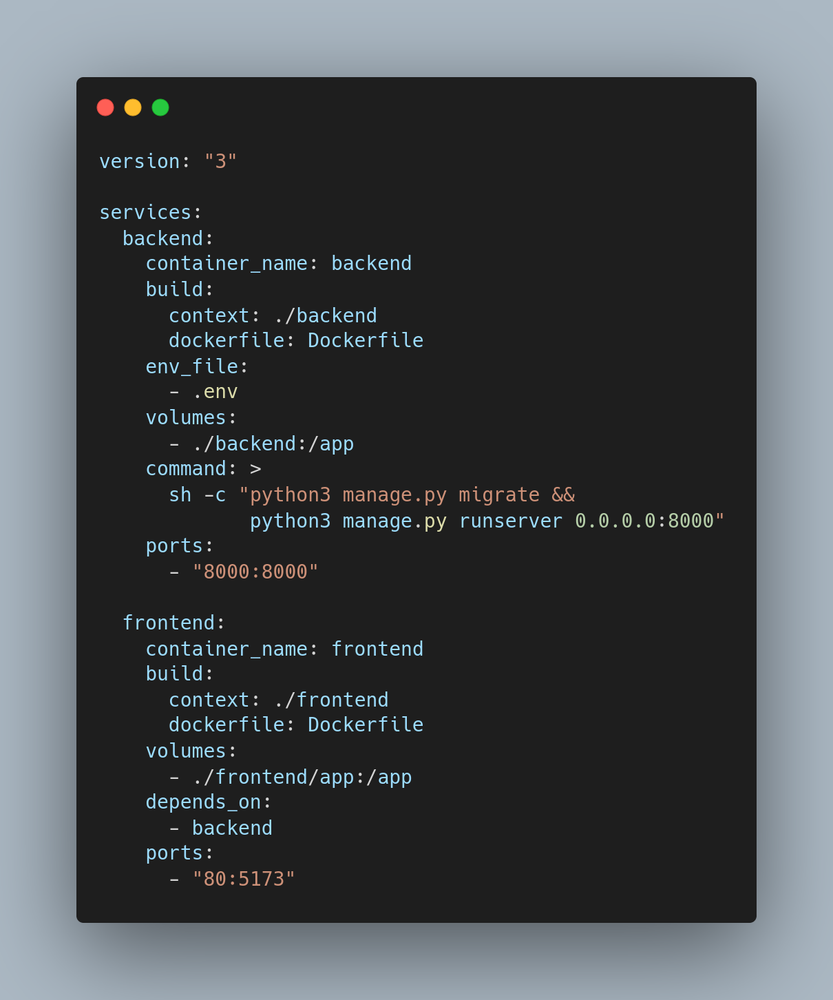

Agora, você já pode acessar o app Vue.js no localhost/ 
(por isso defini a porta na máquina como 80 no 
docker-compose.yaml, para dispensar a escrita da porta na url)

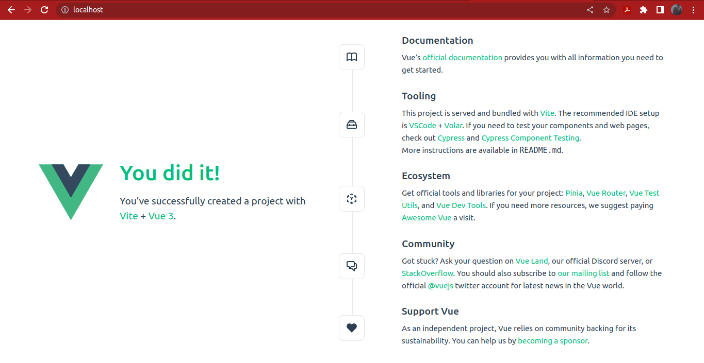 <hr>

## Proxy Reverso para Backend
Beleza, mas como fazer para que o front se conecte ao meu backend?
Simples. Podemos criar um proxy reverso para que, sempre que haja 
uma requisição na rota /api/, o nginx redirecione essa requisição 
para nosso backend. Basta alterar o arquivo nginx.conf e adicionar 
essas linhas:

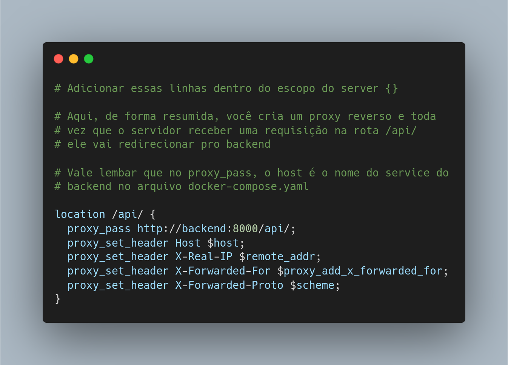
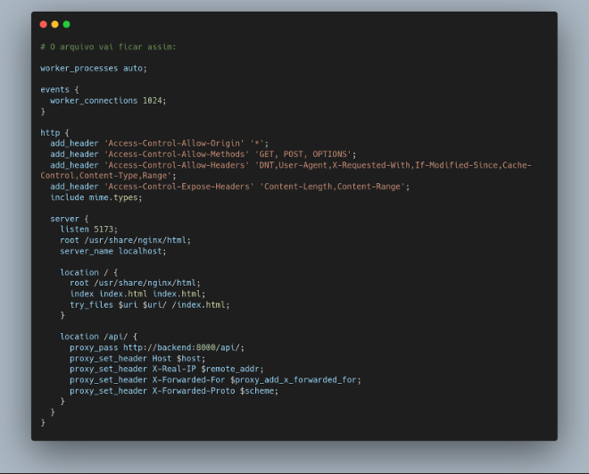


Agora se você acessar a url localhost/api/, já vai ser 
redirecionado pro app Django

Vale lembrar que da última vez acessamos o backend com a url 
localhost:8000/. Mas agora, como configuramos o proxy reverso 
do nginx, devemos acessar o backend pelo nginx, que vai encaminhar 
a requisição.

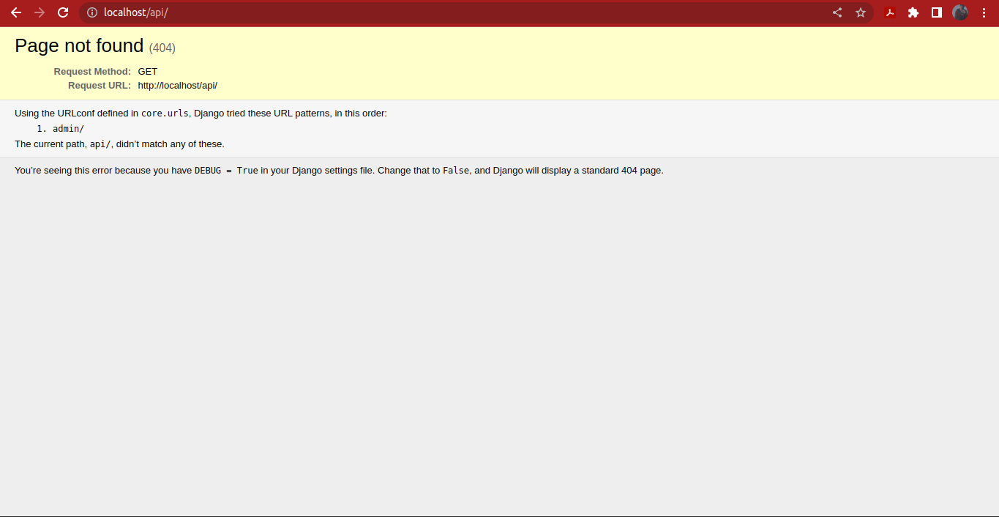

Agora, só pra não recebermos a mensagem do Django dizendo que não 
tem nenhuma url /api/ no app, vou criar aqui só pra termos uma 
resposta concreta e visual:

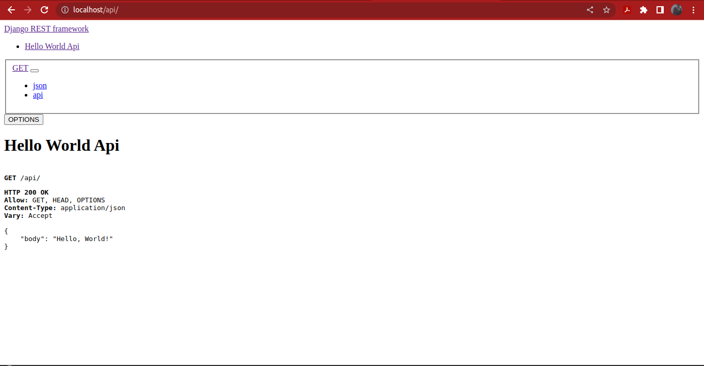 <hr>

## Problema: HTML sem arquivos estáticos
Beleza, agora quando acessamos a rota /api/, recebemos um 200 OK e 
um Hello, World! Mas por que é só um HTML cru? Não tem um CSS? Bom, 
o motivo disso é que não configuramos o Nginx para servir os 
arquivos estáticos e de mídia, que são os arquivos CSS, JS etc.

Para que o Nginx possa servir esses arquivos, o primeiro passo é 
adicionar, no nosso arquivo settings.py, as urls dos nossos 
arquivos estáticos. Podemos usar essa configuração:

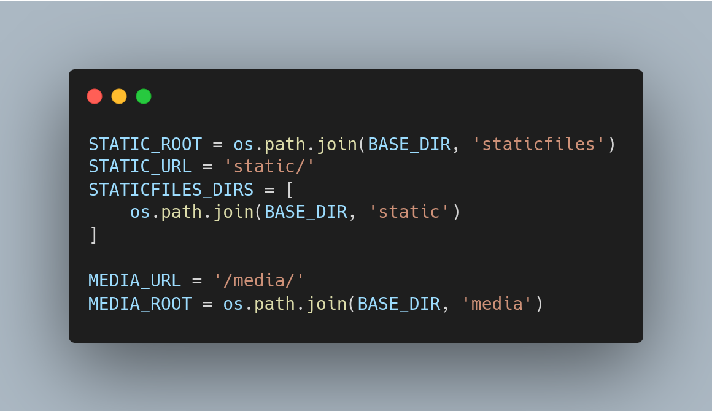 <hr>

## Configurando os staticfiles e mediafiles
Mas não para por aí, precisamos modificar nosso Dockerfile do 
backend, o docker-compose.yaml para adicionar as pastas que vão 
guardar os staticfiles e os mediafiles nos volumes e, por fim, o 
nginx.conf para servir esses arquivos estáticos. As novas 
configurações serão essas:

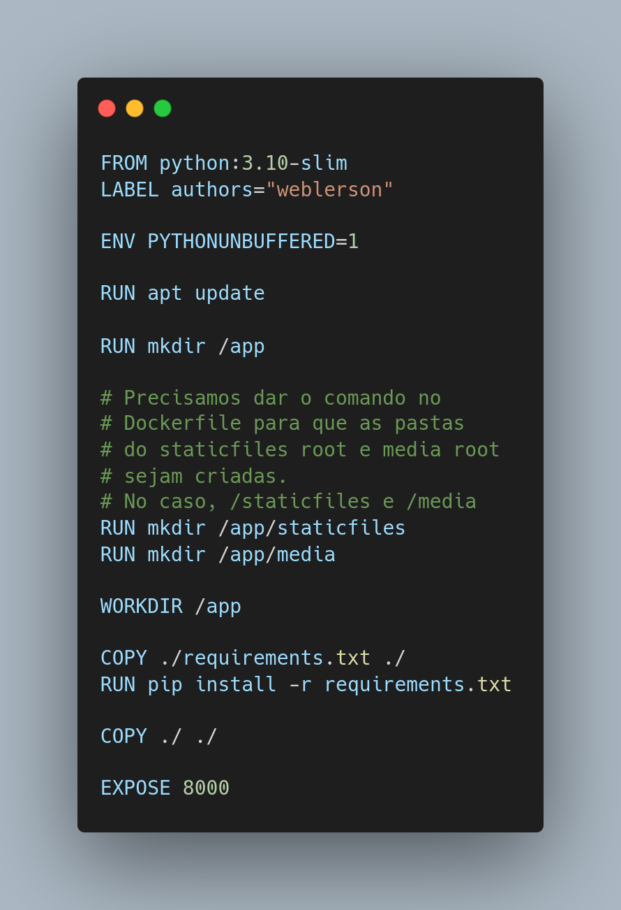
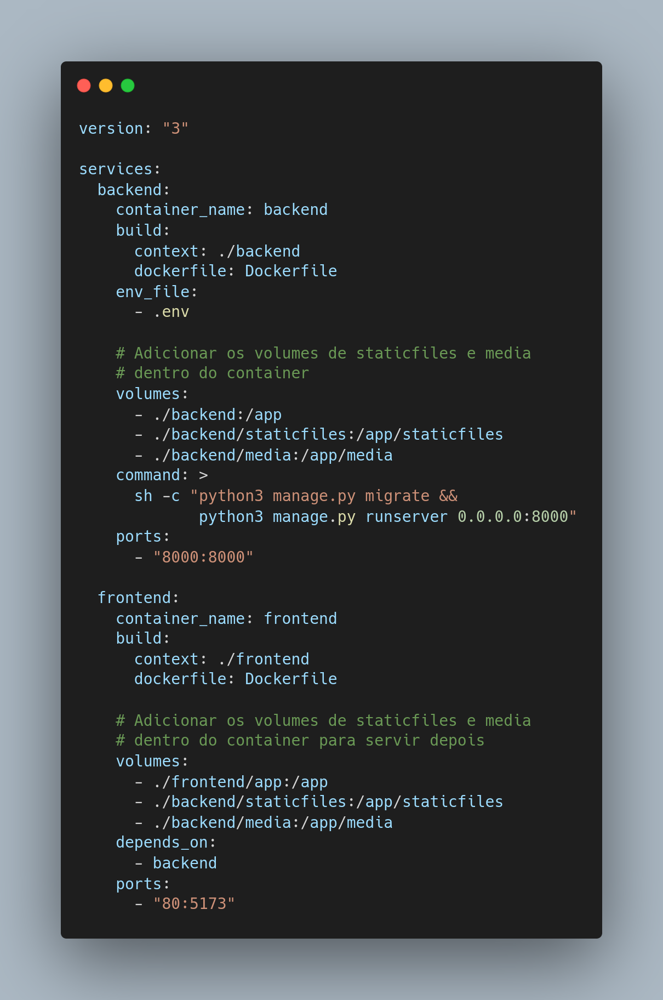
 <hr>

## Coletando arquivos estáticos
Agora, é só entrar na pasta do backend e executar o seguinte 
comando para coletar todos os arquivos estáticos:

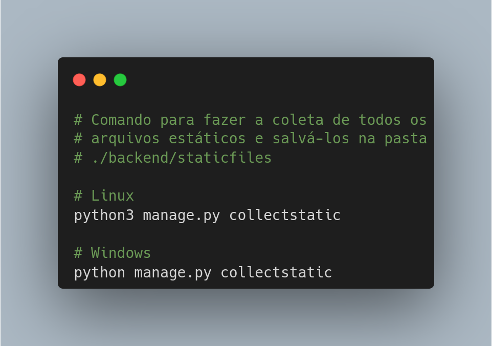

Agora, após recarregar os containers e acessar novamente a url 
localhost/api/, vamos ter o seguinte resultado:

 <hr>

## Fim!
Pronto, agora é só construir toda a API e o front com Vue.js que o 
Nginx e o Docker dão conta do resto. Vale lembrar que às vezes o 
sistema pode pedir permissão para fazer a coleta dos statics. É só 
digitar o comando ```sudo chown -R {seu_user} {pasta}```.

É isso! Esse é o fim da thread que eu decidi escrever pois é de utilidade pública.
Todo o projeto vai estar no Github no meu repositório do projeto

Link: https://github.com/weblerson/Vue-DRF <hr>

## Agradecimentos e Citações
### rodrigo.py: @contracontroIe
Agradecimento ao rodrigo.py que me deu um norte incrível para a
construção desse conhecimento


### Mark Kop: @HeyMarkKop
Bom, ele pediu pra ser citado haha